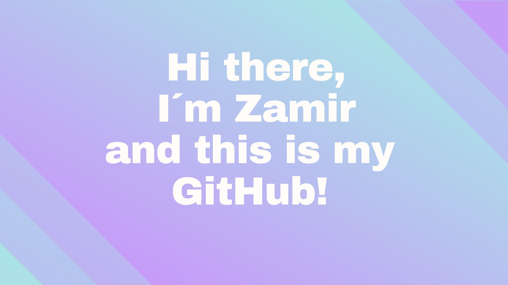

  
  

I'm a Junior Fullstack Web Developer!  
  

- Currently studying [Web developer Fullstack open source] (https://nackademin.se/utbildningar/webbutvecklare-fullstack-open-source/)    
  

   

## Tech I've used before
<!-- <table><tr><td valign="top" width="33%"> -->

  
  
  
  
  
  
  
  
  
  

<!--
</td><td valign="top" width="33%">

</td><td valign="top" width="33%"> 
</td></tr></table>   -->

   

## Connect with me  
 

<!-- -->
  

